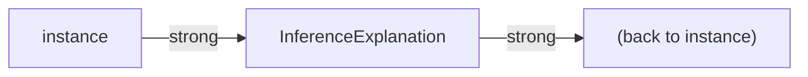

---
jupytext:
  text_representation:
    extension: .md
    format_name: myst
    format_version: 0.13
    jupytext_version: 1.16.4
kernelspec:
  display_name: Python 3
  language: python
  name: python3
---

# Inference Explanation Internals

## Goals and Constraints

The Inference Explanation subsystem answers the question "how was this object created?" for any
instance produced by an EQL `inference(...)` rule. The design is governed by four constraints:

1. **No global registry** — storing explanations in a class-level mapping (for example, a
   `WeakKeyDictionary`) creates hard-to-diagnose memory leaks and couples explanation lifetime
   to a global object rather than to the instance. The design must make the explanation's
   lifecycle identical to the instance's lifecycle.

2. **Non-invasive instrumentation** — the core evaluation logic in `base_expressions.py` must
   not be modified to add explanation-specific code. New concerns (tracking, recording) must be
   injectable as separate components.

3. **Queryable metadata** — an explanation must be a first-class entity that can be filtered,
   joined, and composed using EQL itself, so that downstream consumers (planners, debuggers) can
   extract structured information without string parsing.

4. **Safe call-stack capture** — Python `inspect.FrameInfo` objects hold a live reference to
   their frame, which in turn holds all local variables. Capturing a raw `FrameInfo` list
   prevents those local variables from being collected. The capture mechanism must eagerly
   extract all needed data and immediately release the frame reference.

## Architecture Overview

The subsystem is built from four collaborating layers:

```mermaid
flowchart TD
    subgraph L1["Layer 1: Call-stack capture"]
        L1_paths["krrood/entity_query_language/_stack.py<br>krrood/entity_query_language/_monitoring.py"]
        L1_desc["@monitored decorator patches __post_init__ to capture a CallStack<br>of StackFrame objects as each monitored InstantiatedVariable is<br>created. StackFrame eagerly extracts all data from the live frame."]
    end

    subgraph L2["Layer 2: Evaluation observer pipeline"]
        L2_paths["krrood/entity_query_language/evaluation.py"]
        EC[EvaluationContext] -->|observers| ET[EvaluationTracker]
        ET --> SCT[SatisfiedConditionTracker]
        SCT --> IR[InferenceRecorder]
        IR -->|on_result_yielded| RI[register_inference(instance, node, result)]
    end

    subgraph L3["Layer 3: Explanation storage"]
        L3_paths["krrood/symbol_graph/symbol_graph.py"]
        L3_desc["Symbol._inference_explanation_: Optional[InferenceExplanation]<br>Declared init=False; set by register_inference after construction."]
    end

    subgraph L4["Layer 4: Explanation API"]
        L4_paths["krrood/entity_query_language/explanation/explanation.py"]
        L4_desc["InferenceExplanation(Symbol): meta-query methods, stack methods,<br>condition_graph(), as_string()"]
    end

    L1 -->|_creation_stack stored on variable instance| L2
    L2 -->|explanation attached to instance| L3
    L3 -->|callers query the explanation| L4
```

## Layer 1 — Call-Stack Provenance

### Design: eager extraction via `StackFrame.from_frame_info`

`StackFrame` (`krrood/src/krrood/entity_query_language/_stack.py`) is an immutable data class
that eagerly extracts everything needed from a live `inspect.FrameInfo` at construction time
and immediately drops the frame reference. This satisfies constraint 4: no live frame objects
are retained, so all frame-local variables can be collected normally.

`CallStack` is an ordered sequence of `StackFrame` objects, innermost frame first. Its
`filter(package=...)` method returns a new stack with external library frames removed, keeping
only frames that belong to user code or a specified package.

### Design: `MonitoredRegistry` — a class decorator that hooks `__post_init__`

`MonitoredRegistry` (`krrood/src/krrood/entity_query_language/_monitoring.py`) is a singleton
registry that doubles as a class decorator. Applying `@monitored` to a dataclass class patches
its `__post_init__` method to capture a `CallStack` immediately after the dataclass constructor
runs, storing it as `self._creation_stack`. The original `__post_init__` is preserved and
called after the stack is recorded.

This design satisfies constraint 2: the classes being monitored (`InstantiatedVariable` and its
subclasses) do not need to know about the monitoring infrastructure. The decorator injects the
capture behaviour from outside.

The singleton instance `monitored` (defined at module level in `_monitoring.py`) is imported
wherever decoration or lookup is needed. Isolation is maintained by keeping `_monitoring.py`
free of intra-package EQL imports, which breaks what would otherwise be a circular import
between `variable.py` and `explanation.py`.

## Layer 2 — The Evaluation Observer Pipeline

### Hook points in `_evaluate_`

`SymbolicExpression._evaluate_` (`krrood/src/krrood/entity_query_language/core/base_expressions.py`)
is the single wrapper that manages the evaluation context lifecycle and notifies observers. It
calls four hooks:

| Hook | When | Purpose |
|---|---|---|
| `on_evaluate_enter` | Before evaluating an expression | Record that this expression was entered |
| `on_result_yielded` | For each `OperationResult` yielded | Stamp IDs onto the result and record inferences |
| `on_conclusions_processed` | At the conditions root after all conditions | Build the final `satisfied_condition_ids` set |
| `on_evaluate_exit` | After all results have been yielded | Available for custom cleanup |

### The three built-in observers

**`EvaluationTracker`** accumulates a running set of expression IDs (stored in the context's
`data` dict under `EVALUATED_IDS_KEY`) as the tree is traversed. On `on_result_yielded` it
snapshots the current set onto each `OperationResult` as `evaluated_expression_ids`. This set
is what allows `SatisfiedConditionTracker` to distinguish expressions that were short-circuited
(and therefore absent from the chain truth map) from expressions that genuinely evaluated to
`False`.

**`SatisfiedConditionTracker`** waits until the conditions root fires `on_conclusions_processed`,
then walks the `OperationResult` chain to build a `chain_truth_map` (expression ID to `is_false`
flag). It iterates over every expression ID in `evaluated_expression_ids` and classifies each
condition participant as satisfied or not. `LogicalOperator` nodes not present in the chain
truth map were short-circuited. The final `OrderedSet` is written back to
`result.satisfied_condition_ids`.

**`InferenceRecorder`** listens on `on_result_yielded`. When the expression is an
`InstantiatedVariable` (but not a `Query` or its subclasses, which only remap bindings without
creating new instances) and the expression ID appears in the result's bindings, it calls
`register_inference` to attach an `InferenceExplanation` to the newly created instance.

### `create_default_evaluation_context` — the single extension point

The observer list is not hard-coded inside `_evaluate_`. Instead,
`create_default_evaluation_context()` is the authoritative factory that assembles the three
built-in observers into an `EvaluationContext`. `_evaluate_` calls this factory only when no
context is already active (the `contextvars.ContextVar` is `None`).

Adding a new built-in observer requires only a change to `create_default_evaluation_context`.
Injecting a custom observer for a single evaluation pass (without affecting global behaviour)
requires constructing an `EvaluationContext` directly and installing it via
`set_evaluation_context`, which returns a `contextvars.Token` for safe reset.

```python
from krrood.entity_query_language.evaluation import (
    EvaluationContext,
    EvaluationObserver,
    set_evaluation_context,
    _evaluation_context_var,
)


class MyObserver(EvaluationObserver):
    def on_result_yielded(self, expression, result):
        # custom logic here
        ...


custom_context = EvaluationContext(observers=[MyObserver()])
token = set_evaluation_context(custom_context)
try:
    results = my_query.tolist()
finally:
    _evaluation_context_var.reset(token)
```

The `contextvars.ContextVar` is thread- and async-safe by construction: each thread or
coroutine gets its own independent copy of the variable, so concurrent evaluations do not
interfere with each other.

## Layer 3 — Explanation Storage on `Symbol`

### Why `InferenceExplanation` inherits from `Symbol`

Inheriting from `Symbol` makes every explanation a first-class entity in the `SymbolGraph`.
This satisfies constraint 3: explanations are queryable via EQL using the same meta-query
methods that operate on any other domain object. Clearing the `SymbolGraph` in tests also
clears all explanations automatically, because explanations are registered in the graph like
any other `Symbol`.

### Why `_inference_explanation_` is declared on `Symbol` with `init=False`

The field is declared directly on the `Symbol` base class so that no protocol, mixin, or
interface is needed — every inferred object is already a `Symbol`. The `init=False` flag
ensures the field is never visible as a constructor parameter in any subclass; callers cannot
accidentally set it. The field is excluded from `__repr__` and `__eq__` to avoid polluting
equality semantics and string output.

The runtime import of `InferenceExplanation` inside `symbol_graph.py` is guarded by
`TYPE_CHECKING` to prevent a circular import: `symbol_graph.py` is a dependency of
`explanation.py`, so a regular top-level import would create a cycle.

### Weakref back-reference prevents a reference cycle

`InferenceExplanation` stores a `weakref.ref` back to its instance rather than a strong
reference. Without this, the ownership chain would create a cycle:



Both objects would keep each other alive indefinitely even when no external code holds either.
The `weakref` breaks the cycle: only the instance holds a strong reference to its explanation;
the explanation can be collected along with the instance when the instance's reference count
drops to zero.

## Benefits and Drawbacks

**Benefits**

- Explanations are first-class EQL entities. All meta-query methods (`get_satisfied_condition_expressions_for_the_instance`, `get_conditions_that_relate_variables_of_types`, and so on) are themselves EQL queries, which means they compose with other EQL queries naturally.
- The observer pipeline is closed to modification but open to extension: new built-in observers require only a change to `create_default_evaluation_context`; one-off custom observers require no changes to any existing code.
- Memory safety is explicit and architectural: weak references, `init=False` fields, per-instance caches, and eager frame extraction all prevent leaks at the design level rather than relying on programmer discipline.
- Thread and async safety comes for free from `contextvars.ContextVar`.

**Drawbacks**

- The `SatisfiedConditionTracker.on_conclusions_processed` method must walk the full `OperationResult` chain to reconstruct the truth map. This is linear in the number of conditions, which is acceptable for typical query sizes but could become measurable for very large condition trees.
- The `@monitored` decorator patches `__post_init__`, which means it must be applied only to dataclasses. Applying it to a regular class (without `__post_init__`) is silently accepted but produces an empty `_creation_stack` on construction.
- Eager frame extraction captures the stack at query-definition time, not at query-evaluation time. For queries defined at module import time and evaluated much later, the call stack may not point to the most relevant user code.

## Extension Guide

To add a new built-in observer (one that participates in every EQL evaluation):

1. Subclass `EvaluationObserver` and implement whichever hook methods you need.
2. Add an instance of your observer to the list returned by `create_default_evaluation_context` in `krrood/src/krrood/entity_query_language/evaluation.py`.

To add a one-off custom observer without touching global behaviour:

1. Subclass `EvaluationObserver`.
2. Construct an `EvaluationContext` with your observer, install it via `set_evaluation_context`, and reset the context via the returned token after the evaluation completes.

To extend `InferenceExplanation` with a new meta-query method:

1. Add the method to `InferenceExplanation` in `krrood/src/krrood/entity_query_language/explanation/explanation.py`.
2. Build the query body using `create_explanation_variable()` and `create_query_node_variable()` as the starting points; these provide the explanation and its query-node variable, from which any traversal of the expression tree can be built.

To monitor a new class (so its creation stack is captured):

1. Apply the `@monitored` decorator to the class. The class must be a dataclass (or otherwise have a `__post_init__` method).

## API Reference
- {py:class}`~krrood.entity_query_language.explanation.explanation.InferenceExplanation`
- {py:func}`~krrood.entity_query_language.explanation.explanation.register_inference`
- {py:func}`~krrood.entity_query_language.explanation.explanation.explain_inference`
- {py:class}`~krrood.symbol_graph.symbol_graph.Symbol`
- {py:func}`~krrood.entity_query_language.evaluation.create_default_evaluation_context`
- {py:class}`~krrood.entity_query_language.evaluation.EvaluationContext`
- {py:class}`~krrood.entity_query_language.evaluation.EvaluationObserver`
- {py:class}`~krrood.entity_query_language.evaluation.EvaluationTracker`
- {py:class}`~krrood.entity_query_language.evaluation.SatisfiedConditionTracker`
- {py:class}`~krrood.entity_query_language.evaluation.InferenceRecorder`
- {py:func}`~krrood.entity_query_language.evaluation.set_evaluation_context`
- {py:func}`~krrood.entity_query_language.evaluation.get_evaluation_context`
- {py:class}`~krrood.entity_query_language._stack.CallStack`
- {py:class}`~krrood.entity_query_language._stack.StackFrame`
- {py:class}`~krrood.entity_query_language._monitoring.MonitoredRegistry`
